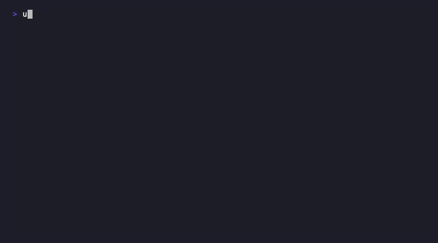
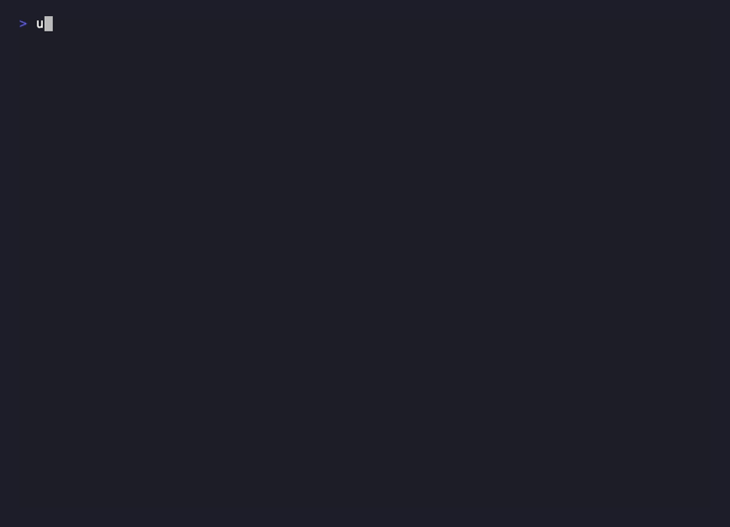

# Optical Character Recognition (OCR) from Scratch

An end-to-end OCR system built from scratch in Python — no ML frameworks. Recognizes handwritten/printed digits and letters from images using classical computer vision techniques and a custom logistic regression classifier.

---

## Overview

This project implements a complete OCR pipeline that:
- Preprocesses raw images (derotation, noise removal, character segmentation)
- Extracts histogram-based features from each character
- Trains a binary logistic regression classifier per character using gradient descent
- Achieves **97–100% validation accuracy** on trained character classes

Everything — from image processing to the learning algorithm — is implemented using only Python's standard library and Pillow.

---

## Demo

**Training** — gradient descent converging on label `6` over 300 iterations:



**Validation** — pre-trained weights evaluated across all 21 character classifiers:



---

## Pipeline

```
Raw Image
    |
    v
[1] Preprocessing
    - Detect & correct image rotation (sine-wave twist correction)
    - KNN noise removal: keep a dark pixel only if >= 5 of its 8 neighbors are also dark
    - Segment image into individual characters via column histogram gaps
    |
    v
[2] Feature Extraction
    - Resize character to 12 x 50 pixels
    - Horizontal histogram: dark pixel count per column  (12 values)
    - Vertical histogram:   dark pixel count per row     (50 values)
    - Result: 62-dimensional feature vector per character
    |
    v
[3] Classification (One-vs-Rest Logistic Regression)
    - One binary classifier trained per character
    - Sigmoid: P(y=1 | x, w) = 1 / (1 + e^(-w·x))
    - Gradient descent, convergence at |gradient| < 0.5
    - Predict: argmax probability across all classifiers
    |
    v
Character Label
```

---

## How KNN Is Used for Noise Removal

For each dark pixel, the algorithm checks all **8 surrounding pixels** (the 3×3 neighborhood). If **4 or fewer** of those neighbors are dark, the pixel is considered isolated noise and is erased (set to white). If 5 or more neighbors are dark, the pixel is part of a genuine character stroke and is kept.

This is a nearest-neighbor majority vote: foreground pixels cluster together, while noise pixels are isolated — and the 8-neighbor count is the decision boundary.

---

## Model Performance

Validation accuracy across trained character classes:

| Character | Accuracy | Correct / Total |
|-----------|----------|-----------------|
| `4`       | 100.0%   | 42 / 42         |
| `5`       | 98.7%    | 34 / 46         |
| `6`       | 99.2%    | 42 / 48         |
| `7`       | 100.0%   | 40 / 40         |
| `a`       | 98.9%    | 48 / 58         |
| `b`       | 97.1%    | 20 / 47         |
| `c`       | 99.7%    | 55 / 57         |
| `d`       | 98.7%    | 38 / 49         |
| `f`       | 99.9%    | 36 / 37         |
| `g`       | 100.0%   | 47 / 47         |
| `h`       | 98.7%    | 36 / 46         |
| `k`       | 98.2%    | 26 / 42         |
| `m`       | 100.0%   | 38 / 38         |
| `n`       | 99.6%    | 43 / 47         |
| `p`       | 99.3%    | 45 / 51         |
| `q`       | 98.8%    | 47 / 55         |
| `s`       | 98.0%    | 28 / 49         |
| `v`       | 99.0%    | 38 / 47         |
| `w`       | 98.7%    | 45 / 56         |
| `x`       | 98.4%    | 30 / 46         |
| `y`       | 100.0%   | 50 / 50         |

---

## Project Structure

```
OpticalCharacterRecognition/
├── project.py          # Full OCR pipeline (preprocessing, features, training, validation)
├── data_points/        # Feature vectors extracted from training images (one file per character)
├── w_list/             # Pre-trained logistic regression weights and accuracy per character
├── pyproject.toml      # Project metadata and dependencies (managed with uv)
└── README.md
```

---

## Requirements

- Python 3.8+
- [uv](https://github.com/astral-sh/uv) (package manager)
- Pillow

---

## Installation

```bash
git clone https://github.com/tusharjayanti/OpticalCharacterRecognition.git
cd OpticalCharacterRecognition
uv sync
```

---

## Usage

```bash
uv run python project.py
```

You will be prompted to choose a mode:

| Mode | Description |
|------|-------------|
| `1`  | **Train** — Train a classifier from scratch for a given character |
| `2`  | **Validate** — Run 10-fold cross-validation using pre-trained weights |
| `3`  | **Demo** — Classify characters in a new image *(coming soon)* |

### Training a new character

1. Place positive-example PNGs in `data_points/<character>/`
2. Run the program and select mode `1`
3. Enter the character label (e.g. `a`, `6`)
4. Weights are saved to `w_list/w_list_<label>.txt`

### Preprocessing raw images

```python
from project import remove_noise, gather_data_points

remove_noise('path/to/images')          # denoise and segment
gather_data_points('path/to/classes')   # extract features into data_points/
```

---

## Technical Details

| Parameter | Value |
|-----------|-------|
| Feature dimensions | 62 (12 horizontal + 50 vertical histogram bins) |
| Classifier type | Binary logistic regression (one-vs-rest) |
| Noise filter | 8-neighbor KNN majority vote |
| Optimization | Gradient descent |
| Learning rate (initial training) | 0.00005 |
| Learning rate (fine-tuning) | 0.000003 |
| Convergence criterion | Gradient magnitude < 0.5 |
| Validation strategy | 10-fold cross-validation |
| External ML libraries | None |

---

## Limitations & Future Work

- Demo mode (mode 3) is not yet implemented — end-to-end prediction on new images is a planned addition
- Some character classes have limited training data (fewer than 40 samples)
- Characters not yet trained: `0`, `1`, `2`, `e`, `i`, `j`, `l`, `o`, `r`, `u`, `z`
- Could be extended with a neural network classifier for improved accuracy on ambiguous characters
